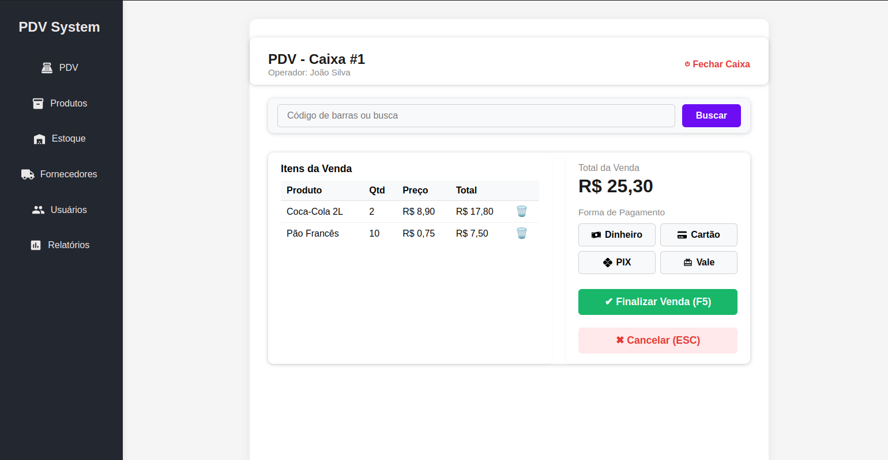

# PDV Electron



## O que é este projeto?

Este é um sistema de **Ponto de Venda (PDV)** desenvolvido em Electron.js e React.js, pensado para pequenos e médios estabelecimentos que precisam de uma solução moderna, fácil de usar e que funcione mesmo offline.

## Principais Funcionalidades

- **Operação offline** com verificação automática de atualizações
- **Cadastro e edição de produtos** com upload de imagem e máscara de preço
- **Controle de estoque** com paginação, busca e filtros
- **Relatórios e histórico de vendas** (em desenvolvimento)
- **Controle de caixa**
- **Suporte a múltiplas formas de pagamento**
- **Impressão térmica de comprovantes**
- **Interface otimizada para toque e teclado**
- **Arquitetura modular para fácil manutenção**

## Telas do Sistema

### Tela PDV

A tela principal do caixa, onde o operador registra produtos, seleciona formas de pagamento e finaliza vendas de forma rápida e prática.

### Outras Telas
- Cadastro de produtos
- Controle de estoque
- Relatórios e usuários

## Como instalar e rodar o projeto

1. **Clone o repositório:**
   ```bash
   git clone <url-do-repositorio>
   cd pdv-electron
   ```
2. **Instale as dependências:**
   ```bash
   yarn install
   # ou
   npm install
   ```
3. **Inicie o sistema:**
   ```bash
   yarn start
   # ou
   npm start
   ```

O sistema será aberto em uma janela Electron. Você pode usar normalmente mesmo sem internet.

## Estrutura do Projeto

- `src/renderer/src/components`: Componentes reutilizáveis (modais, inputs, etc)
- `src/renderer/src/page/produtos`: Tela de cadastro e listagem de produtos
- `src/renderer/src/page/estoque`: Tela de controle de estoque
- `src/renderer/src/masks`: Máscaras de input reutilizáveis
- `services/`: Serviços de acesso a dados e integração

## Requisitos
- Node.js 16+
- Yarn ou npm

## Contribuição
Pull requests são bem-vindos! Sinta-se à vontade para sugerir melhorias ou reportar problemas.

## Histórico de Atualizações

- 18/04/2025: Atualizações e melhorias realizadas, incluindo ajustes e correções nas telas de fornecedores e navegação.

---

> Projeto desenvolvido para facilitar a gestão de vendas e estoque de pequenos negócios, com foco em praticidade e robustez.
